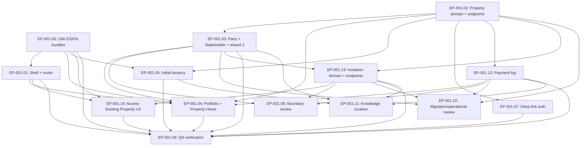

# EP-001 — First Property Experience

- **Plan ID:** EP-001
- **Revision:** r3 (APPROVED)
- **Originating task:** [DONARIUM-PA-EXP-001 — First Property Experience Engineering Plan](../../agents/tasks/engineering_log_1/DONARIUM-PA-EXP-001—FirstPropertyExperienceEngineeringPlan.md)
- **Role:** `product-architect` (OSK role v0.1.0, contract [`engineering-plan-contract.md`](../../../.osk/roles/product-architect/references/engineering-plan-contract.md))
- **Date:** 2026-09-02
- **Stitch project of record:** `projects/16518901730411508270` — "Donarium Property Experience".

## Status

**APPROVED** — Product Authority approval recorded 2026-09-02.

- **Approving authority:** Product Authority (via review recorded in this conversation, 2026-09-02).
- **Approved scope:** the reconciled product boundary; assumptions and constraints as amended through Product Authority review; candidate work nodes EP-001.01…EP-001.14; dependency topology; Role ownership; review and verification strategy; ADR intentions; explicit exclusions; First Property Experience scope.
- **Qualifications:** OP-9 was corrected from the r2 recommendation (shareable URL only; no in-app pending list; delivery decoupled). OP-10 was approved with the recommended dormant-until-account-exists behavior; acceptance must not introduce signup.
- **Approval enables:** transition from PROPOSE → APPROVED → MATERIALIZE. Downstream Role invocation and code changes remain UNAUTHORIZED at this stage.

## Revision history

- **r1 (2026-09-02):** Initial proposal with eight open product decisions (OP-1…OP-8). Reconciled r1 rationale is preserved implicitly through r2 and r3.
- **r2 (2026-09-02):** Amended after Product Authority review of r1. Reconciled OP-1…OP-8 through objective, boundary, assumptions, domain, use cases, work nodes, graph, critical path, Roles, exclusions, and approval request. Introduced OP-9 (invitation delivery/discovery) and OP-10 (invitation to unregistered email) as the only remaining material uncertainty.
- **r3 (2026-09-02, this document):** APPROVED. Incorporates the Product Authority's OP-9 correction (shareable URL only, no in-app pending list; invitation decoupled from delivery) and OP-10 resolution (dormant-until-account; no signup at acceptance; token possession alone is insufficient; authenticated identity must match intended recipient). Removes the in-app "Pending Invitations" surface from EP-001.13 and EP-001.14. Introduces one explicit assumption (A-14) about the interpretation of "matching verified identity" against the current identity model.

### Disposition of the previously open questions

| Question | Disposition |
|---|---|
| OP-1 — Property scope | Resolved. Both personal and organization contexts are valid; Party = `User` \| `Organization` \| `ExternalParty`; no synthetic default Organization. |
| OP-2 — Invitation door | Resolved. Invitation flow in scope. |
| OP-3 — Language | Resolved. Bilingual ES/EN, frontend i18n only. |
| OP-4 — Register Offline Payment | Resolved. Included as narrow log. |
| OP-5 — Property classification | Resolved. Canonical enum {House, Apartment, Condominium, Multi-unit, Commercial, Other}. "Property" canonical; "Unit" reserved. |
| OP-6 — Deep links and invitation authorization | Resolved. Normal deep link on non-authorized property → 404. Invitation four outcomes; expiration is distinct from unauthorized (A-11: HTTP 410 Gone). |
| OP-7 — DON-007R gating | Resolved by evidence inspection. No hard blocker. Three hygiene constraints (H-2, H-3, H-4) absorbed into EP-001. |
| OP-8 — 3-Signal Scannability | Resolved. Principle, not a data contract. |
| OP-9 — Invitation delivery/discovery | **Corrected by PA.** Shareable URL only; inviter is responsible for external delivery; invitation creation and delivery are separate concerns. No in-app pending list in EP-001. Future invitation-created events may enable delivery via other channels; explicitly outside EP-001. |
| OP-10 — Invitation to unregistered email | Resolved. Invitation remains dormant until an authenticated account with matching identity exists AND the invitation remains valid/unexpired. Acceptance does not create accounts. Token possession alone does not grant access. Authenticated accepter must match the intended recipient. |

## Objective, boundary, and approval

### Objective

Deliver the **First Property Experience** in Donarium — the smallest coherent surface that lets an authenticated party either register a first Property or accept an invitation to an existing Property, inhabit its Property Home, navigate a multi-property Portfolio, and record a payment received against a Property — without prematurely committing the Leases or broader Payments domain models.

### In boundary

- Post-login shell and session-aware routing that leans on the existing `AuthenticatedPrincipal` from `identity/application/authentication/principal_resolver.go`.
- **Zero Properties (First Access)** page with two entry paths: *Register a Property* and *Access an Existing Property* (informational; access happens by opening a shared invitation URL).
- **Register New Property** flow — identity + per-property Owner/Manager relationships (Party = `User` | `Organization` | `ExternalParty`) + initial-tenancy declaration (property-side; not a Lease).
- **Property Home** — identity, stakeholders, specifications, milestones stub, documents stub, and a **narrow payment log** section.
- **Portfolio** — list/grid, minimal filters/sort; cards render the most relevant *available* signals per OP-8.
- **Invitation flow** — issue, list, revoke, accept. Delivery is decoupled: Donarium produces a shareable URL; the inviter distributes it externally.
- **Register Offline Payment** — narrow log: amount, received date, method, notes, recorded-by.
- **Deep-link entry** — `/properties/:id` and `/invitations/:token/accept`, both with sane unauthenticated-redirect behavior and the OP-6 authorization outcomes.
- **Bilingual UI (ES/EN)** using the existing frontend i18n approach; no backend i18n.

### Out of boundary

- **Leases as a domain.**
- **Payments as a domain** beyond the narrow log — no billing schedules, arrears, ACH, auto-pay, settlement, ledger, on-time ratios, receipt PDFs.
- **Incidents / maintenance module.**
- **Documents module.**
- **External integrations** (ACH banks, DocuSign, GIS, IoT, sub-metering, SMS notifications, CSV bulk import, agency reporting sync).
- **Backend internationalization.**
- **Invitation delivery mechanisms** (email, SMS, in-app notifications, in-app pending-invitations panel). Only the shareable URL is produced by Donarium.
- **Signup / account creation during invitation acceptance.**
- **User-facing audit-log surface.**
- **"Unit"** as a subordinate structure inside a Property — reserved for a future concept per OP-5.
- **Rich global search, Settings, Help** — nav placeholders only.
- **Multi-organization switching UX** — existing `defaultContext` is honored.

### Approval scope and qualifications

Approval covers scope, assumptions A-3…A-14, candidate work nodes EP-001.01…EP-001.14, dependency topology, Role ownership, review/verification strategy, five ADR intentions (ADR-003…ADR-007), placements, and exclusions. Approval does not authorize execution; only materialization of the plan into canonical OSK task artifacts is authorized by this approval. Materialization exposes work nodes for downstream Role adoption; each Role's independent execution requires its own operational composition and evidence.

## Grounding and project topology

### Product / experience authorities

- **Task specification** — `docs/agents/tasks/engineering_log_1/DONARIUM-PA-EXP-001—FirstPropertyExperienceEngineeringPlan.md`. Authoritative for scope and stop-condition.
- **Product Authority approvals of r1 and r2** — recorded in §Revision history and the OP disposition table.
- **Roadmap** — `ROADMAP.md`. Sequences Properties as step 5. DON-007R gating re-evaluated on evidence (see below).
- **README** and **Design Constitution** — `README.md`, `knowledge/design/DonariumDesignConstitution.md`.
- **Business rules** — `knowledge/business-rules.md` (BR-01…BR-09, all bootstrap-scoped).
- **Stitch project `projects/16518901730411508270`** — treated as design evidence.

### Engineering authorities

- **Repository state (2026-09-02):** only `internal/identity/` implemented in Go monolith. Client has only `LoginExperience`; no router.
- **Existing ADRs** — `knowledge/decisions/ADR-001-installation-bootstrap.md`, `ADR-002-application-level-bootstrap-invariant.md`.
- **OSK role catalog installed** (`.osk/roles/`): `product-architect` (v0.1.0), `software-engineer` (v0.2.0), `qa-engineer` (v0.2.0), `engineering-reviewer` (v0.1.0), `platform-engineer` (v0.1.0), `knowledge-curator` (v0.1.0).
- **OSK Blueprint discipline** — `docs/OSK.md`.

### DON-007R evidence and conclusion

Direct inspection of `docs/agents/reviews/DON-007R-initial-owner-setup-architecture-review.md` (Verdict: CHANGES REQUIRED). No finding creates a hard dependency for EP-001. Three findings become EP-001 hygiene constraints:

- **H-2** — New documentation introduced by EP-001 must not cite the contradicted sections of UC-001, BR-05/06/08, or ADR-001 as authorities. Property stakeholder semantics stand on their own and reference the accurate code shape (`Membership` per-organization; `PlatformGrant` platform-wide).
- **H-3** — EP-001 integration tests that use PostgreSQL require a dedicated `TEST_DATABASE_URL` and fail explicitly when unavailable. No `os.Exit(0)` silent-pass patterns.
- **H-4** — All new EP-001 HTTP endpoints emit JSON error responses consistently, including on `405 Method Not Allowed`, and preserve the `Allow` header.

R-001 and R-004 do not affect EP-001. R-006 (README freshness) is not gating; `knowledge-curator` may address opportunistically.

### Actors

- **Owner** and **Manager** — per-property Roles held by a Party. They are relationships, not User types.
- **Party** — `User` | `Organization` | `ExternalParty(name, email)`. `ExternalParty` confers no Donarium access.
- **Invitee** — a User whose authenticated identity matches an invitation's intended recipient email.
- **Payment recorder** — the authenticated User who logs a received payment (`RecordedBy` on the Payment record).

### Use cases (candidates)

- **UC-003 — Register a Property.** Declare identity, per-property Owner/Manager relationships (four Stitch options), optional initial-tenancy state. Post: at least one stakeholder record ties the acting User to it (directly or via an Organization Membership).
- **UC-004 — Inhabit a Property Home.** Identity, stakeholders, specifications, milestones stub, documents stub, payment log; supports deep-link entry.
- **UC-005 — Navigate the Portfolio.** ≥2 accessible properties; minimal filters/sort; cards render available signals per OP-8.
- **UC-006 — Invite a Party to a Property.** Authorized stakeholder issues an invitation (recipient email + offered Role + optional expiration). Response includes a shareable URL for external distribution.
- **UC-007 — Accept an invitation to a Property.** Recipient opens the URL. Donarium authenticates, then verifies the authenticated identity matches the intended recipient; on success and validity, creates a `PropertyStakeholder(UserRef, OfferedRole)`.
- **UC-008 — Register a payment received for a Property.** Authorized stakeholder records amount, received date, method, notes.

### Domain concepts / entities

- **`Property`** — aggregate root. `PropertyID`, `DisplayName` (user-defined, independent of classification), `Classification` (canonical enum per OP-5), `Address` (structured minimum), `RentalCadence` (enum: monthly, weekly, daily, annual), `StandardRent`, `CreatedAt`, `CreatedBy`. **No Organization-scope column.**
- **`Party`** — `UserRef(UserID)` | `OrganizationRef(OrganizationID)` | `ExternalParty(Name, Email)`.
- **`PropertyStakeholder`** — `(PropertyID, PartyRef, Role: OWNER | MANAGER, CreatedAt)`. Multiple stakeholders per Property. Uniqueness `(PropertyID, PartyRef, Role)` per A-12.
- **`PropertyInitialTenancy`** — additive on Property: `Occupied` (tenant contact + expiry + payment-due day + security deposit) or `Vacant`. Not a Lease.
- **`Payment`** — `(PaymentID, PropertyID, Amount, ReceivedAt, Method, Notes, RecordedBy, CreatedAt)`. No billing, no ledger.
- **`Invitation`** — `(InvitationID, PropertyID, IntendedRecipientEmail, OfferedRole: OWNER | MANAGER, IssuedBy, IssuedAt, ExpiresAt?, AcceptedAt?, AcceptedBy?, RevokedAt?, Token)`. Token is opaque; 16-character format from Stitch is not required. Delivery is decoupled: Donarium exposes the shareable URL to the issuer and does nothing else with it.

### Property access rule (from OP-1)

A User `u` has access to a Property `p` iff a `PropertyStakeholder` exists on `p` such that:

- `PartyRef = UserRef(u.ID)`, or
- `PartyRef = OrganizationRef(o.ID)` and `u` has a `Membership` on `o`.

`ExternalParty` stakeholders confer no Donarium access.

### Invitation authorization rule (from OP-6 + OP-10)

For `POST /api/invitations/{token}/accept`:

- Unauthenticated request → **401 Unauthorized** (client redirects to login, preserves return URL).
- Token not found → **404 Not Found**.
- Token found but revoked → **404 Not Found** (do not disclose prior existence).
- Token expired → **410 Gone** (A-11) with a machine-readable outcome envelope distinct from 401/403/404.
- Authenticated User's normalized email ≠ invitation.IntendedRecipientEmail (normalized) → **403 Forbidden**.
- Valid + intended → **201 Created** with the new stakeholder record, in the same transaction as the acceptance timestamp.

For `GET /api/invitations/{token}`: same outcome model, applied to disclosure of invitation details.

Token possession alone never grants access (OP-10). If no account exists for the intended recipient, the invitation remains dormant until such an account is created via another flow (which is out of EP-001 scope).

### Assumptions in force

- **A-3** — Per-property Roles live in a new `PropertyStakeholder` relation; `OrganizationRole` is not extended.
- **A-4** — Visible Stitch integrations (ACH, DocuSign, GIS, IoT, SMS, CSV) remain design hypotheses, not requirements. Invitations are in scope but delivery is not.
- **A-5** — Property Home sections without a supporting domain (incidents, documents, milestones) render explicit empty states; no mock data. The payment section is populated by the narrow payment log.
- **A-6** — Wizard Step 3's initial-tenancy capture is stored declaratively on the Property; a future Leases slice can promote it into a `Lease` without a destructive migration.
- **A-7** — "3-Signal Scannability" is a design principle; Portfolio cards render the most relevant available signals from {financial, attention, next milestone} and may render fewer.
- **A-8** — In v1, invitation acceptance is personal only: the invitee accepts on their own behalf and becomes a `UserRef` stakeholder. Acceptance on behalf of an `Organization` is a later slice.
- **A-9** — Language selection defaults to the browser locale, with a persisted preference in `localStorage`; a Settings-based switcher is not built in EP-001; ES fallback if neither ES nor EN.
- **A-10** — Initial `Payment.Method` enum is `{ check, cash, wire, other }`; refinements within engineering authority.
- **A-11** — Expired invitations return **HTTP 410 Gone** with a machine-readable outcome envelope distinct from 401/403/404 — engineering representation of the OP-6 "explicit expired outcome".
- **A-12** — `PropertyStakeholder` uniqueness is `(PropertyID, PartyRef, Role)`; the same Party may hold both OWNER and MANAGER on the same Property.
- **A-13** — In v1, both OWNER and MANAGER stakeholders may issue invitations; a finer-grained permission model is out of scope.
- **A-14** — "Matching verified identity" in the OP-10 resolution is interpreted as: the normalized email of the authenticated User's account (`user.email`) equals the normalized `invitation.IntendedRecipientEmail`. This aligns with the current identity model, which stores one normalized email per User. If the Product Authority intended cryptographic email verification (a verification-link flow), that capability is not present in the codebase and would be a separate scope decision; PA may override this assumption without invalidating the plan graph.

### Where durable artifacts live (per `docs/OSK.md`)

- **This plan:** `docs/engineering/plans/DONARIUM-PA-EXP-001-first-property-experience-engineering-plan-proposal.md` (filename preserved for continuity; canonical EP-001 identifier is stable).
- **Task specifications:** `docs/engineering/agents/tasks/EP-001.NN-<slug>.md` (materialized under this approval).
- **Implementation reports:** `docs/engineering/agents/reports/EP-001.NN-<slug>.md`.
- **Independent reviews:** `docs/engineering/agents/reviews/EP-001.NN-<slug>.md`.
- **QA records:** authored by `qa-engineer`, colocated under `docs/engineering/agents/reports/`.
- **Durable domain knowledge:** `docs/knowledge/properties/` — created by EP-001.11 when concepts are established.
- **Business rules:** appended to `knowledge/business-rules.md` (new heading, numbered from BR-19 as they are finalized).
- **New ADRs** (authored by the assigned Role during their slice; not stubbed at materialization):
  - **ADR-003** — Client routing choice (EP-001.01).
  - **ADR-004** — `PropertyStakeholder` per-property relation (EP-001.03).
  - **ADR-005** — Party model (EP-001.03).
  - **ADR-006** — Invitation semantics (EP-001.13).
  - **ADR-007** — Payment log representation (EP-001.12).
- **Roadmap update:** `ROADMAP.md` acknowledges EP-001 delivery when nodes complete.
- **Engineering log:** `docs/engineering/ENGINEERING_LOG.md` receives the EP-001 plan row at materialization; per-node rows arrive as nodes complete.

## Dependency graph

## Work nodes

Each work node is authoritative in itself; the graph aids comprehension of dependency and permitted parallelism.

### EP-001.01 — Post-login shell, router, and empty-state routing decision

- **Assigned Role:** `software-engineer`
- **Intent and outcome:** An authenticated User lands on an authenticated shell. Post-login routing consults `/api/auth/me` and `GET /api/properties`; when no accessible property exists, the User sees Zero Properties; when exactly one exists, the User is routed to that Property Home; when several exist, the User is routed to the Portfolio. Deep-link entries preserve the return URL through login.
- **Relevant context and requirements:** Existing `LoginExperience` is the only rendered page; there is no client router. `principal_resolver.go` already emits `PlatformRoles`, `OrganizationContexts`, `DefaultContext`. Design Constitution and Stitch theme guidance apply. Bilingual copy must consume i18n keys emitted by EP-001.06.
- **Constraints / established direction:** Client-side routing library chosen and recorded in ADR-003 (recommended: React Router). No backend changes. WCAG AA baseline, visible focus, keyboard nav, reduced-motion, large touch targets. Complies with H-4 for any new client error boundaries that surface HTTP errors.
- **Expected evidence:** ADR-003 authored and linked. Manual walk-throughs of Zero Properties → single Property Home → Portfolio branches. Deep-link entry with return-URL preservation demonstrated. Screenshot or notes preserved with the report.
- **Dependencies:** EP-001.06 (i18n bundles). No backend dependency for start.
- **Permitted parallelism:** May proceed in parallel with EP-001.02.
- **Handoff / stop condition:** Supplies the routing shell and the authenticated layout. Does not implement property, invitation, or payment behavior; those arrive from EP-001.02, .12, .13, .14.

### EP-001.02 — Property domain + `POST/GET /api/properties`

- **Assigned Role:** `software-engineer`
- **Intent and outcome:** A `Property` domain type, repository, and application service exist. `POST /api/properties` registers a property (identity + classification + address + cadence + standard rent). `GET /api/properties` lists properties accessible to the authenticated User per the Property access rule. `GET /api/properties/{id}` returns a Property overview.
- **Relevant context and requirements:** No `Property` exists in code. Reuse the existing `TransactionManager`. Access rule: User is a direct stakeholder OR has a Membership in an Organization stakeholder — this rule is finalized in EP-001.03 but the access seam must be built here to accept stakeholder-based filtering. Classification enum per OP-5. Complies with H-3 and H-4.
- **Constraints / established direction:** No Organization-scope column on Property. Additive migration `006_properties`. All endpoints protected by `RequireAuthentication`. Deep-link authorization outcome per OP-6 is finalized in EP-001.07 but the endpoint here must not disclose existence to unauthorized readers.
- **Expected evidence:** Integration tests against dedicated `TEST_DATABASE_URL` (H-3) exercising the round-trip. Endpoint behavior evidence for happy path, empty list, and unauthenticated access. Draft SQL for `006_properties` available for EP-001.10.
- **Dependencies:** None.
- **Permitted parallelism:** May proceed in parallel with EP-001.01. Blocks EP-001.03, .04, .05, .07, .12, .13.
- **Handoff / stop condition:** Property is a first-class entity with the minimum endpoints. Stakeholders, initial tenancy, payment log, invitations are out of this node.

### EP-001.03 — Party model + `PropertyStakeholder` + Wizard Step 2

- **Assigned Role:** `software-engineer`
- **Intent and outcome:** A Party model (`UserRef` | `OrganizationRef` | `ExternalParty`) is introduced. `PropertyStakeholder(PropertyID, PartyRef, Role, CreatedAt)` persists per-property Owner/Manager relationships. `RegisterProperty` is extended to atomically persist declared stakeholders. Wizard Step 2 exposes the four Stitch options.
- **Relevant context and requirements:** `Membership` and `OrganizationRole` are not extended. Uniqueness `(PropertyID, PartyRef, Role)` per A-12. Complies with H-2 (does not cite the contradicted UC-001/BR-05/BR-08/ADR-001 sections). Access rule finalization from EP-001.02 lands here.
- **Constraints / established direction:** Additive migration `007_property_stakeholders`. ADR-004 authored (Stakeholder relation vs extending `OrganizationRole`). ADR-005 authored (Party model). External stakeholders confer no access.
- **Expected evidence:** Integration tests exercising each of the four Stitch relationship options and post-conditions. Access-rule tests for {User-direct, User-via-Organization, ExternalParty (no access)}. ADR-004 and ADR-005 authored and linked. Draft SQL for `007_property_stakeholders`.
- **Dependencies:** EP-001.02.
- **Permitted parallelism:** After EP-001.02 lands, may proceed in parallel with EP-001.05, EP-001.07, EP-001.12.
- **Handoff / stop condition:** Supplies stakeholder attribution to EP-001.04 (header) and enables EP-001.13 (invitation acceptance).

### EP-001.04 — Portfolio and Property Home read model

- **Assigned Role:** `software-engineer`
- **Intent and outcome:** Portfolio page and Property Home page render with real identity, stakeholders, specifications, and payment-log content; incidents/documents/milestones sections render explicit empty states.
- **Relevant context and requirements:** Portfolio minimum filters: All / Managed by You / Owned by You / Invited by You. Minimum sort: Recently Changed. OP-8 principle: render available signals from {financial, attention, next milestone}; may render fewer; never fabricate.
- **Constraints / established direction:** No mock data. Design Constitution and Stitch theme guidance apply. Bilingual copy via EP-001.06.
- **Expected evidence:** UI walkthrough of Zero → 1 property → multi-property transitions. Property Home rendering evidence for both fully-populated and mostly-empty properties. Screenshot or notes preserved.
- **Dependencies:** EP-001.01, EP-001.02, EP-001.03, EP-001.12.
- **Permitted parallelism:** List/grid scaffolding may begin after EP-001.02; header attribution and payment content wait for EP-001.03 and EP-001.12.
- **Handoff / stop condition:** Property Home and Portfolio are readable. Editing existing properties is out of this node.

### EP-001.05 — Wizard Step 3: initial tenancy declaration (property-side)

- **Assigned Role:** `software-engineer`
- **Intent and outcome:** Registration captures an initial tenancy declaration: `Occupied` (tenant contact + expiry date + payment-due day + security deposit) or `Vacant`. Stored on the Property; no `Lease`.
- **Relevant context and requirements:** Structured so a future Leases slice can promote the initial tenancy into a real `Lease` without destructive migration (A-6).
- **Constraints / established direction:** Additive Property columns or a small `PropertyInitialTenancy` record.
- **Expected evidence:** Round-trip evidence for both Occupied and Vacant; explicit no-op when Vacant. Migration draft included in EP-001.10 review.
- **Dependencies:** EP-001.02.
- **Permitted parallelism:** Independent of EP-001.03, .04, .07, .12, .13 once EP-001.02 lands.
- **Handoff / stop condition:** Registration captures the initial tenancy declaration. Editing tenancy after registration is out of this node.

### EP-001.06 — Bilingual i18n materialization (ES/EN, frontend only)

- **Assigned Role:** `software-engineer`
- **Intent and outcome:** `client/src/shared/i18n/` gains an EN bundle alongside the existing ES bundle. New keys for the entire EP-001 experience are present in both. Language defaults per A-9 (browser locale + `localStorage` preference; ES fallback).
- **Relevant context and requirements:** Only frontend i18n; no backend i18n. No Settings-based switcher in EP-001.
- **Constraints / established direction:** Preserve the existing i18n approach.
- **Expected evidence:** Both bundles present with parity for new keys; language default behavior demonstrated in a browser with each of {ES locale, EN locale, other locale}.
- **Dependencies:** None.
- **Permitted parallelism:** Independent; schedule early to remove copy rework in EP-001.01, .04, .05, .14.
- **Handoff / stop condition:** Copy is available for consuming nodes. Language selection UX beyond the default is out of scope.

### EP-001.07 — Deep-link `/properties/:id` authorization (non-invitation)

- **Assigned Role:** `software-engineer`
- **Intent and outcome:** `PropertyAccessPolicy` on `GET /api/properties/{id}` returns 404 for authenticated but non-authorized requesters (OP-6). Router preserves return URL for unauthenticated deep links; on login return, the intended URL is revisited.
- **Relevant context and requirements:** Access rule from EP-001.03. Invitation acceptance authorization is a separate concern owned by EP-001.13.
- **Constraints / established direction:** 404, not 403, for the non-invitation deep link. Complies with H-4.
- **Expected evidence:** Endpoint tests for {authenticated authorized, authenticated non-authorized, unauthenticated} with the expected outcomes. Client-side return-URL test.
- **Dependencies:** EP-001.02.
- **Permitted parallelism:** Independent of EP-001.03, .04, .05, .12, .13 once EP-001.02 lands.
- **Handoff / stop condition:** Deep-link authorization is enforced for property URLs. Invitation URL authorization lives in EP-001.13.

### EP-001.08 — Independent boundary review

- **Assigned Role:** `engineering-reviewer`
- **Intent and outcome:** Independently assesses (a) the Party model and its persistence shape; (b) the decision to add `PropertyStakeholder` rather than extend `OrganizationRole`; (c) the identity/properties transactional seam; (d) Invitation semantics against ADR-006; (e) the Payment-log boundary against future Payments-domain freedom; (f) whether EP-001 documentation avoids repeating DON-007R R-002 (H-2 compliance).
- **Relevant context and requirements:** Independent judgment; must not silently rewrite the implementation.
- **Constraints / established direction:** Follows Engineering Reviewer role contract; produces findings with severity/evidence/recommendations.
- **Expected evidence:** Review record at `docs/engineering/agents/reviews/EP-001.08-boundary-review.md` with findings and recommendations.
- **Dependencies:** EP-001.03 (ADR-004, ADR-005), EP-001.12 (ADR-007), EP-001.13 (ADR-006).
- **Permitted parallelism:** May proceed in parallel with EP-001.09 once inputs exist.
- **Handoff / stop condition:** Findings reported. Repair authority remains with the implementing Role.

### EP-001.09 — Verification of outcome for the experience

- **Assigned Role:** `qa-engineer`
- **Intent and outcome:** Independently establishes claim → evidence for: first-access routing decision; register happy path per each of the four relationship options; deep-link authorization (both OP-6 cases); invitation four-outcome authorization (401/404/410/403/201); payment log post-conditions; bilingual copy consistency; A-9 default behavior; explicit empty states.
- **Relevant context and requirements:** Enforces H-3 across new integration tests. Verifies outcomes, not merely executions.
- **Constraints / established direction:** QA does not repair, redesign, or invent product intent. Preserves evidence with provenance.
- **Expected evidence:** QA record at `docs/engineering/agents/reports/EP-001.09-verification.md` with claim → evidence → observation → judgment.
- **Dependencies:** EP-001.01, EP-001.02, EP-001.03, EP-001.04, EP-001.05, EP-001.06, EP-001.07, EP-001.12, EP-001.13, EP-001.14.
- **Permitted parallelism:** After its dependencies land.
- **Handoff / stop condition:** Judgment recorded. Discovered failures return to the implementing Role.

### EP-001.10 — Migration and operational review

- **Assigned Role:** `platform-engineer`
- **Intent and outcome:** Reviews four new migrations (`006_properties`, `007_property_stakeholders`, `008_payments`, `009_invitations`) for reversibility, index strategy, and startup behavior; confirms no session/config/runtime changes are needed; confirms H-4 across new endpoints. Confirms that Donarium's invitation URL production does not silently require an operational communication pipeline (OP-9 correction).
- **Relevant context and requirements:** Additive migrations only.
- **Constraints / established direction:** Do not redefine product behavior; escalate if an operational addition is required.
- **Expected evidence:** Review notes with per-migration observations and confirmations at `docs/engineering/agents/reviews/EP-001.10-migration-and-operational-review.md`.
- **Dependencies:** EP-001.02, EP-001.03, EP-001.12, EP-001.13 (draft SQL).
- **Permitted parallelism:** Runs against drafts as they appear.
- **Handoff / stop condition:** Migration/schema/operational judgment recorded. Repair authority remains with the implementing Role.

### EP-001.11 — Knowledge curation

- **Assigned Role:** `knowledge-curator`
- **Intent and outcome:** Creates `docs/knowledge/properties/` with canonical current explanations for Property, Party, PropertyStakeholder, Classification, RentalCadence, Initial Tenancy, Payment log, Invitation. Places ADR-003…ADR-007. Updates `ROADMAP.md` acknowledgment and `docs/engineering/ENGINEERING_LOG.md` per-node rows as nodes complete.
- **Relevant context and requirements:** Complies with H-2. Coordinates with DON-007R remediation window if it overlaps. Preserves engineering reports as history and ADRs as rationale.
- **Constraints / established direction:** Does not decide product intent. Preserves prior rationale.
- **Expected evidence:** Knowledge tree present and linked. ADRs placed. Engineering log updated.
- **Dependencies:** EP-001.03, EP-001.05, EP-001.12, EP-001.13 as sources of truth. Iterates across the plan.
- **Permitted parallelism:** Independent knowledge/nav work continuous.
- **Handoff / stop condition:** Knowledge surface is discoverable and traceable. Ongoing maintenance continues post-EP-001.

### EP-001.12 — Register Offline Payment (narrow log)

- **Assigned Role:** `software-engineer`
- **Intent and outcome:** `Payment(PaymentID, PropertyID, Amount, ReceivedAt, Method, Notes, RecordedBy, CreatedAt)`; migration `008_payments`; endpoints `POST /api/properties/{id}/payments` and `GET /api/properties/{id}/payments`; payment-log section on Property Home rendered as a chronological list.
- **Relevant context and requirements:** Method enum per A-10 (`{ check, cash, wire, other }`). No billing, ACH, auto-pay, arrears, settlement, ledger, on-time ratios, receipt PDFs. Complies with H-3 and H-4.
- **Constraints / established direction:** Additive migration only. ADR-007 authored (Payment log representation).
- **Expected evidence:** Integration tests exercising the log post-conditions. ADR-007 authored. Draft SQL for `008_payments`.
- **Dependencies:** EP-001.02.
- **Permitted parallelism:** Independent of EP-001.03, .05 once EP-001.02 lands.
- **Handoff / stop condition:** Log-only capability is available. Anything ledger-like is out of scope.

### EP-001.13 — Invitation domain and endpoints

- **Assigned Role:** `software-engineer`
- **Intent and outcome:** `Invitation(InvitationID, PropertyID, IntendedRecipientEmail, OfferedRole, IssuedBy, IssuedAt, ExpiresAt?, AcceptedAt?, AcceptedBy?, RevokedAt?, Token)`; migration `009_invitations`; opaque token generation; endpoints:
  - `POST /api/properties/{id}/invitations` — issue (authorization A-13). Response includes the shareable acceptance URL.
  - `GET /api/properties/{id}/invitations` — list invitations for a given Property (issuer-scoped view).
  - `GET /api/invitations/{token}` — return invitation display details for the intended recipient; four-outcome authorization per OP-6.
  - `POST /api/invitations/{token}/accept` — accept; on success, creates `PropertyStakeholder(UserRef(u.ID), OfferedRole)` in the same transaction and records `AcceptedAt`/`AcceptedBy`.
  - `DELETE /api/invitations/{token}` — revoke by issuer or by an OWNER stakeholder of the Property.
- **Relevant context and requirements:** No in-app pending-invitations panel; no email delivery; delivery is entirely external. Invitation is decoupled from delivery. Authorization outcomes per Invitation authorization rule (§Grounding). A-14 governs identity match. Complies with H-2, H-3, H-4.
- **Constraints / established direction:** Token is opaque; do not adopt the 16-character format from Stitch as a requirement. Expiration returns HTTP 410 Gone (A-11). Do not create accounts (OP-10).
- **Expected evidence:** Integration tests exercising each authorization outcome (401/404/410/403/201) and the revoke path. ADR-006 authored. Draft SQL for `009_invitations`. Explicit assertion that no delivery mechanism is introduced.
- **Dependencies:** EP-001.02, EP-001.03.
- **Permitted parallelism:** After its dependencies land, may proceed in parallel with EP-001.04, .05, .07, .12.
- **Handoff / stop condition:** Invitation capability exposes the URL and validates acceptance. Delivery is outside this node forever.

### EP-001.14 — "Access an Existing Property" client experience

- **Assigned Role:** `software-engineer`
- **Intent and outcome:** Zero Properties page includes an "Access an Existing Property" informational area explaining that access happens by opening an invitation URL shared by the inviter. Accept-invitation page at `/invitations/:token/accept` renders the four authorization outcomes with dignified messaging per OP-6, including a distinct expired-invitation state. Bilingual copy per EP-001.06.
- **Relevant context and requirements:** No in-app pending-invitations list. If the invitee is not authenticated when opening the URL, the client preserves the return URL through login. If authenticated but the identity does not match, render the 403 outcome without offering signup or account switching.
- **Constraints / established direction:** No signup. No account creation. Copy must not imply that Donarium sent the URL. Complies with A-9 language defaults.
- **Expected evidence:** UI walkthrough of each of the five outcomes (unauthenticated redirect → authenticated valid+intended, valid+wrong-recipient, not-found, expired). Screenshots or notes.
- **Dependencies:** EP-001.01, EP-001.13.
- **Permitted parallelism:** After its dependencies land.
- **Handoff / stop condition:** Access path is usable end-to-end via the shareable URL. Any delivery UX is out of scope.

## Material unresolved uncertainty and recommended decisions

- **A-14** — Interpretation of "matching verified identity" (see §Grounding). The plan proceeds under the assumption that the current single-normalized-email-per-User model is sufficient. If the Product Authority intended cryptographic email verification, the plan graph does not change but a separate scope decision is needed for a verification capability outside EP-001. Recommended: confirm A-14 explicitly at first review; otherwise no impact on materialization.

No other material uncertainty remains open. Small engineering decisions (Payment method enum details, language-switcher UX in a future release, exact token format) remain within the implementing Role's authority.

## Plan evolution

- **Prior revisions:** r1 (initial proposal) and r2 (post-review proposal) are preserved in this document's revision history rather than in separate files, so that a single canonical `EP-001` remains the entry point.
- **Future revisions:** any later revision must preserve the r1/r2/r3 rationale and record the new approving authority, date, scope, and qualifications; approval may be revised or withdrawn by the responsible authority.
- **Supersession:** if EP-001 is later superseded (for example by a broader First Property Experience v2 plan), the successor plan links back here and does not silently erase the approval trail.

---

## Appendix A — Migrations added by EP-001

- `006_properties.{up,down}.sql`
- `007_property_stakeholders.{up,down}.sql`
- `008_payments.{up,down}.sql`
- `009_invitations.{up,down}.sql`

All additive and reversible. Reviewed by `platform-engineer` in EP-001.10.

## Appendix B — Endpoints added by EP-001

- `POST /api/properties`
- `GET /api/properties`
- `GET /api/properties/{id}`
- `POST /api/properties/{id}/payments`
- `GET /api/properties/{id}/payments`
- `POST /api/properties/{id}/invitations`
- `GET /api/properties/{id}/invitations`
- `GET /api/invitations/{token}`
- `POST /api/invitations/{token}/accept`
- `DELETE /api/invitations/{token}`

All protected by `RequireAuthentication`. All emit JSON error responses per H-4, including on `405 Method Not Allowed`.

---

**End of approved plan.** Execution is not authorized by this approval. Materialization of the plan into canonical OSK task artifacts is authorized and, when complete, hands off each work node to its assigned Role for independent adoption.
